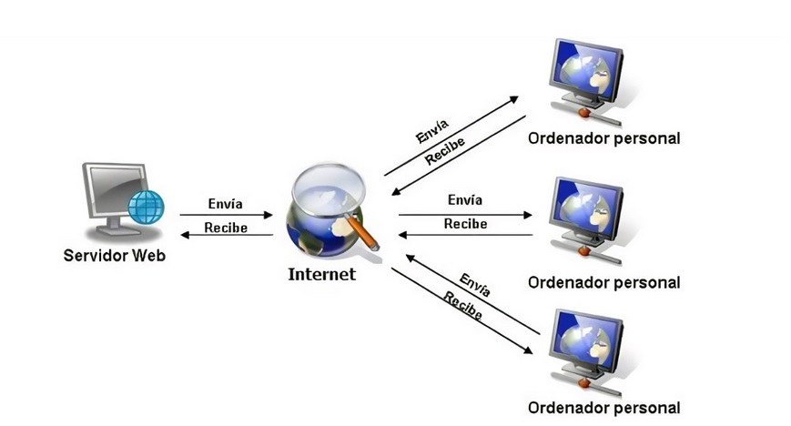

# Evaluación inicial

## 1. ¿Qué es una página web?

Es una interfaz dónde el usuario puede interactuar a través del navegador. Aquello que se crea mediante **lenguaje de marcas** y la interpretación de un **navegador web** sobre ese lenguaje.

## 2. ¿Qué es un servidor web?

Es tanto un **software** como **hardware** que se encargan de mantener el sitio/página web conectada las 24h del día y los 365 días del año. Utiliza un **software** para poder conectar la página/sitio web a internet y un buen **hardware** para un gran almacenamiento y procesamiento de los datos.

## 3. ¿Qué son los lenguajes de marcas?¿Cuántos conoces?

Son lenguajes que te permiten codificar con **etiquetas**.

|**Lenguaje**|**Enlace**|
|:--------:|:--------------------:|
|**SGML**|[Documentación](https://sio2sio2.github.io/LM/01.intro/02b.marcas.html "Documentación")|
|**XML**|[Documentación](https://sio2sio2.github.io/LM/01.intro/02b.marcas.html "Documentación")|
|**GML**|[Documentación](https://techlib.net/techedu/gml-generalized-markup-language/ "Documentación")|
|**HTML**|[Documentación](https://developer.mozilla.org/es/docs/Web/HTML "Documentación")|
|**Markdown**|[Documentación](https://markdown.es/sintaxis-markdown/ "Documentación")|
|**JSON**|[Documentación](https://sio2sio2.github.io/LM/02.validacion/02.yaml.html "Docuentación")|

## 4. ¿Qué es ```HTML```?¿Sabes cómo se estructura?

Es un lenguaje de marcas que se utiliza para crear páginas web mediante **etiquetas**.

```html

<!DOCTYPE html>
<html lang="en">
<head>
    <meta charset="UTF-8">
    <meta name="viewport" content="width=device-width, initial-scale=1.0">
    <title>Document</title>
</head>
<body>
    
</body>
</html>

```
_Figura 1: Estructura de código HTML_

## 5. ¿Qué es ```CSS```?

Es una **hoja de estilos** que ayuda al diseño de una página web, modifica todo tipo de estilo dentro de ella para mejorar la visualización y la modificación de la estructura de un **html**.

## 6. ¿Sabes cómo funciona un navegador web? Describe brevemente el proceso que se sigue para visualizar una página web:

Es una aplicación/programa que permite el acceso web, esto hace que tú puedas entrar a diferentes páginas web mediante tu búsqueda. El navegador traduce/lee toda la codificación de un **lenguaje de marcas** y lo interpreta para que el usuario pueda ver la web.

